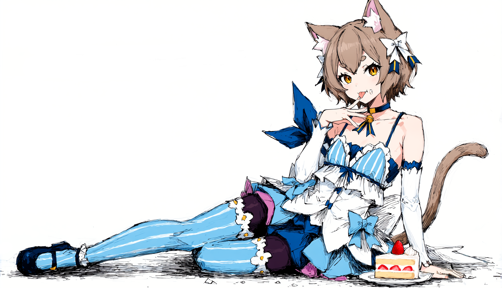

<div align="center">


# huix

**Мой NixOS-флейк — десктоп с NVIDIA/CUDA и ноут на Hyprland плюс домашний сервер без экрана** （´ω｀♡%）


[](ASSETS.md)
[](WORKAROUNDS.md)
[](DEVIATIONS.md)
[](LICENSE)
[](https://github.com/rokokol/huix/actions/workflows/eval.yml)

</div>

Короче, это мой NixOS для рабочего ПК, ноутбука и домашнего сервера: Hyprland, nixvim и куча приложений для повседневных дел. Часть программ я держу отдельно от конфига, а для всего остального стараюсь собрать удобную среду под себя

## Команды

```sh
sudo nixos-rebuild switch --flake .#nixos-pc   # или .#nixos-laptop
rebuild                                        # алиас на то же для текущего хоста
rebuilds                                       # то же, но пакеты с зеркала Яндекса — если проблемы с сетью
```

Станция своего чекаута не держит: её собирает ПК и заливает по Tailscale SSH

```sh
nixos-rebuild switch --flake .#nixos-station --target-host rokokol@nixos-station --sudo --ask-sudo-password
nix build .#station-boot-test -L      # станция в виртуалках рядом с роутером и ПК, только по запросу
nix build .#station-install-test -L   # её установочный образ в виртуалках: отказы и полная установка
```

Первый раз станция ставится с флешки: образ без секретов собирает `nix build .#station-installer`, секреты в копию добавляет `nix run .#make-station-iso -- write result/iso/*.iso OUTPUT`, и этот OUTPUT после установки удаляют. Что станция умеет — в [описании системного слоя](nixos/README.md#станция)

Если поменялось железо, обнови его описание:

```sh
sudo nixos-generate-config --show-hardware-config > nixos/<host>/hardware-configuration.nix
```

Матлаб тоже можно запустить через Nix (★^O^★):

```sh
nix run gitlab:doronbehar/nix-matlab#matlab-shell
nix shell gitlab:doronbehar/nix-matlab#matlab --command /run/media/rokokol/MATHWORKS_R2025A/install
```

## Хосты

| Хост | Назначение |
| ---- | ---------- |
| Рабочий ПК | Рабочий хост для разработки и творческих задач |
| Ноутбук-трансформер | Рабочий хост с сенсорным экраном, пером и режимом планшета |
| Домашний сервер | Хранит резервные копии, собирает состояние хостов и предоставляет домашние службы |

## Карта репозитория

Конфиг разбит на слои, у каждого свой README:

[](nixos/README.md)
[](nixos/services/README.md)
[](nixos/fonts/README.md)
[](home-manager/README.md)
[](home-manager/desktop/hyprland/README.md)
[](home-manager/programs/README.md)
[](home-manager/programs/nixvim/README.md)
[](scripts/README.md)

## Вынесено в отдельные репо

Куски, которые переросли конфиг и живут своими флейками — huix подключает их входами и держит по одному шву на каждый. Вся семья вместе с самим конфигом помечена топиком [huix](https://github.com/topics/huix)

[](https://github.com/rokokol/hyprland-screen-shader)
[](https://github.com/rokokol/claude-account)
[](https://github.com/rokokol/rofi-wooordhunt)
[](https://github.com/rokokol/virtual-media-devices)
[](https://github.com/rokokol/skvpn)
[](https://github.com/rokokol/ddlc-palette)
[](https://github.com/rokokol/ddlc-sddm-theme)
[](https://github.com/rokokol/ddlc-hyprlock)
[](https://github.com/rokokol/ddlc-rofi-theme)
[](https://github.com/rokokol/ddlc.nvim)
[](https://github.com/rokokol/ddlc-themes)

## Пара заметок

- Светлую и тёмную темы можно переключать на лету — выбор переживает перезагрузки и пересборки
- О том, что крутится на машинах, читай в [системном слое](nixos/README.md) и разделе [служб](nixos/services/README.md)

<br/>

---

<div align="center">



<em>an average nixos user :3</em>

<br/>

<table>
<tr><td align="center">

❄️❄️🚀 <b>ВСЕ ВАШИ ПАКЕТНИКИ ГОВНО</b> 🤬❄️<br/> МУТАБЕЛЬНЫЙ МУСОР 🌋🚀❄️ НУЖНО ПЕРЕЙТИ ❄️ НА НИКС ❄️❤️<br/> 😍 НА НИКС ПЕРЕЙДИ ❄️❄️<br/> НА НИКС ПЕРЕЙДИ СУКА 😡❄️<br/> 🚀 МНЕ НУЖНА ❄️❄️ ДЕКЛАРАТИВНОСТЬ СУКА 🚀❄️<br/> ДЕКЛАРАТИВНЫЙ НИКС ПОДХОД 😍❤️🚀❄️<br/> ВСЕ ВАШИ ОС ИМПЕРАТИВНОЕ 🤬💩 ГОВНО ❄️<br/> ❄️ ПЕРЕЙДИ НА НИКС

</td></tr>
</table>

<a href="https://никспобеда.рф"></a>

<sub>❄️ made with declarative love · NixOS ❄️</sub>

</div>
