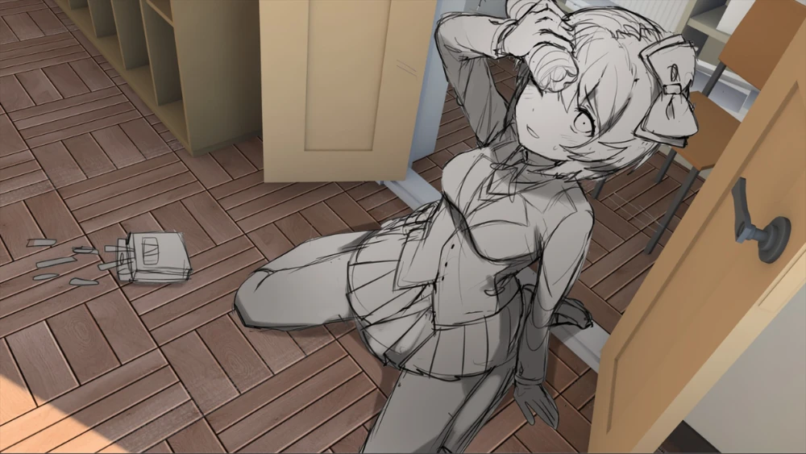

# Программы

Сюда попадают конфиги для программ, которые занимают больше одной строки в `home.packages`. Например, если тянут какие-то свои дополнительные зависимости или имеют нужные мне декларативные настройки. Или просто связанные с ними штуки (*≧m≦*)

## Что внутри

| Файл / каталог | Что это |
| --- | --- |
| `alarm.nix` | будильник: обёртка над `scripts/alarm.sh`, кладёт зависимости в PATH и звук из freedesktop-темы |
| `cli/` | шелл-утилиты: `btop`, `git`, `ssh`, `direnv` |
| `term/` | терминал и шелл: `kitty`, `starship`, `zsh` |
| `nixvim/` | Neovim через Nixvim, см. [nixvim/README.md](nixvim/README.md) |
| `rofi/` | лаунчер rofi с темами, см. [rofi/README.md](rofi/README.md) |
| `thunar.nix` | файловый менеджер + экшен "Open Terminal Here" + mime-дефолты для папок |
| `virtual-mic.nix` | виртуальный микрофон: обёртка над `scripts/virtual-mic.sh` |
| `zen.nix` | браузер Zen с модами и поисковыми движками |

## Тонкости

- `alarm.nix` и `virtual-mic.nix` — тонкие Nix-обёртки, вся логика живёт в [`scripts/`](../../scripts/README.md), Nix только собирает PATH и прокидывает аргументы
- `*-pc`/`*-laptop` разводки здесь нет — программы общие для обоих хостов, host-специфика уезжает в [пакеты desktop-слоя](../desktop/packages)
- `term/zsh.nix` содержит алиасы для терминала

